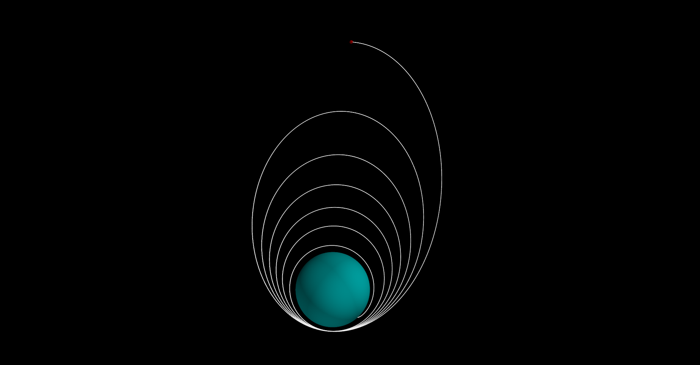
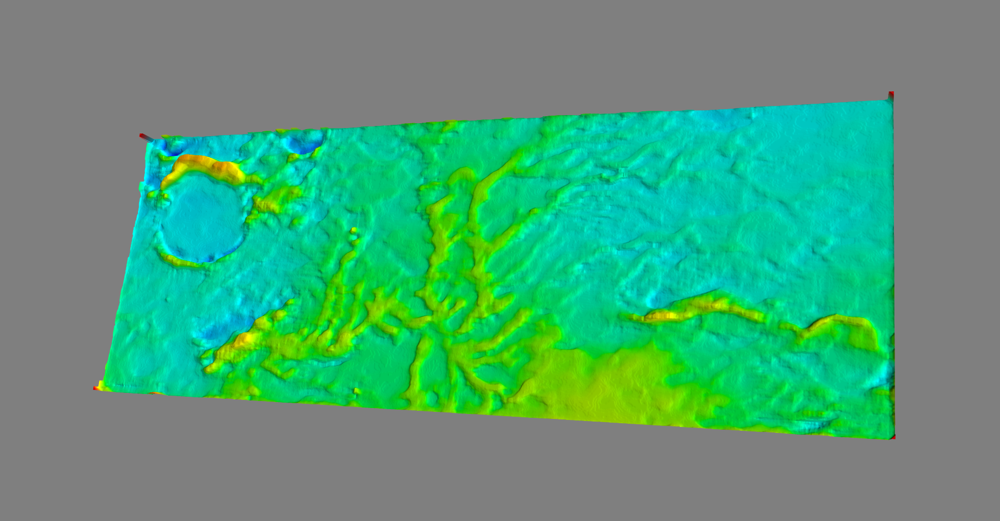

# ksp_autopilot
This project is aimed at creating a few general purpose tools for piloting spacecraft in Kerbal Space Program.  It includes full GNC (guidance, navigation, and control).  Current capabilities include:

* Orbital plotting - plots the spacecrafts current orbit including drag models (assuming coefficients provided) for arbitrary bodies
* Vision based surface analysis - Uses images of the surface to determine good landing locations
* Nonlinear burn solver - (WORK IN PROGRESS) a solver that solves an initial burn for a spacecraft to place it in a desired location
* GFOLD solver - A convex solver for optimal landing trajectory calculation
* Trajectory tracking - A simple linear trajectory tracking control system

Example of the orbital plotting

Vision based surface reconstruction

NOTE: This project is still a work in progress and is intended as a learning tool rather than a supported library for KSP.

### How to use
The ksp_autopilot module contains the AutoPilot class that has associated functions for different operations.  See source for details.

