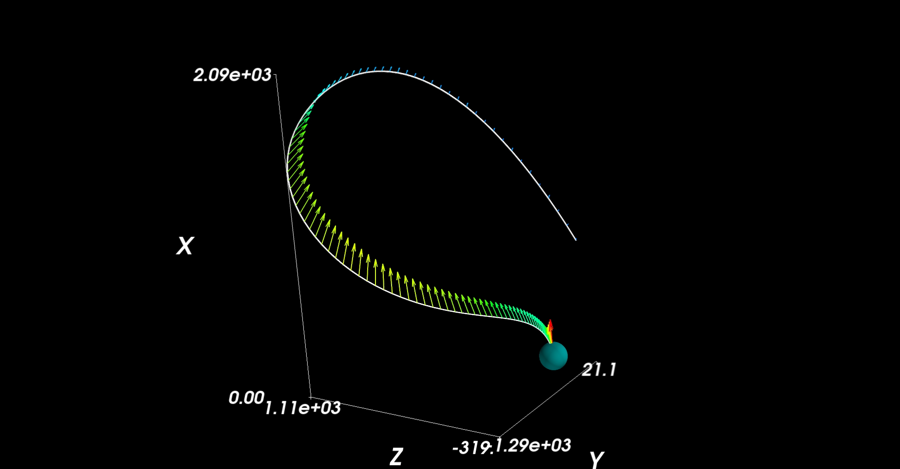

# ksp_autopilot
This project is aimed at creating a few general purpose tools for piloting spacecraft in Kerbal Space Program.  It includes full GNC (guidance, navigation, and control).  Current capabilities include:

* Orbital plotting - plots the spacecrafts current orbit including drag models (assuming coefficients provided) for arbitrary bodies
* Vision based surface analysis - Uses images of the surface to determine good landing locations
* Nonlinear burn solver - (WORK IN PROGRESS) a solver that solves an initial burn for a spacecraft to place it in a desired location
* GFOLD solver (FUEL OPTIMAL LARGE DIVERT) - A convex solver for optimal landing trajectory calculation
* Trajectory tracking - A simple linear trajectory tracking control system


Example of the orbital plotting


Vision based surface reconstruction


GFOLD solver trajectory


NOTE: This project is still a work in progress and is intended as a learning tool rather than a supported library for KSP!  I am happy to answer questions on it and take feature requests though!

### How to use
The ksp_autopilot module contains the AutoPilot class that has associated functions for different operations.  See source for details.  The general usage looks like

```python
from ksp_autopilot import AutoPilot

autopilot = AutoPilot()
autopilot.plot_orbit()
# Position of the helipad in the rotating reference frame
goal_pos = np.array((159188.42536982114, -1012.4470751636361, -578679.892709093))
autopilot.do_landing_burn(goal_position)
```

### Planned features
* Move the per-ship settings (proportial gains, drag coefficients, etc.) to config files
* Currently the GFOLD only does the position optimal solve.  Need to add fuel optimal and line search for final time parameter.
* It is most likely possible to dynamically solve for a controller based on the ship's dynamics (i.e. LQR) so this doesn't need to be recomputed.


